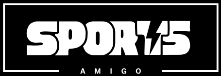

# SportsAmigo - Sports Event Management System



A complete sports event management platform built with Node.js, Express, MongoDB, and EJS.

## Features

- 🏆 Event creation and management
- 👥 User roles (Admin, Organizer, Manager, Player)
- 🏀 Multi-sport support
- 📅 Event scheduling and registration
- 🏅 Team management
- 📊 Player statistics
- 📱 Responsive design

## Tech Stack

**Backend:**
- Node.js
- Express
- MongoDB (Atlas)
- Mongoose
- Bcrypt (Authentication)

**Frontend:**
- EJS Templates
- CSS
- JavaScript

## Prerequisites

- Node.js v16+
- MongoDB Atlas account
- Git

## Installation

1. Clone the repository:
```bash
git clone https://github.com/yourusername/sportsamigo.git
cd sportsamigo
```

2. Install dependencies:
```bash
npm install
```

3. Configure environment:
```bash
cp .env.example .env
```
Edit `.env` with your MongoDB Atlas credentials.

4. Start the development server:
```bash
npm start
```

## Project Structure

```
sportsamigo/
├── config/          # Configuration files
├── controllers/     # Route controllers
├── models/          # Database models
├── public/          # Static assets
├── routes/          # API routes
├── views/           # EJS templates
├── app.js           # Main application
└── package.json     # Dependencies
```

## API Endpoints

| Endpoint | Method | Description |
|----------|--------|-------------|
| /api/users | POST | Create user |
| /api/events | GET | List events |
| /api/teams | POST | Create team |

